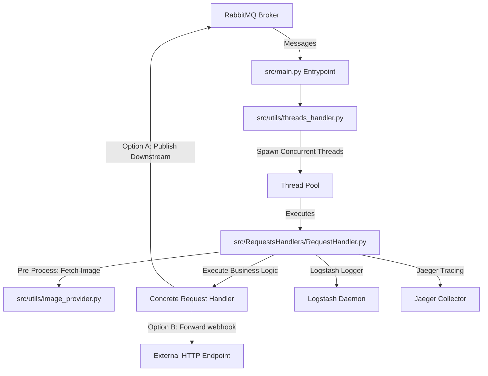

# Rabbit Processor

`RabbitProcessor` is a concurrent, multi-threaded RabbitMQ message processor. It is designed to act as an orhcestrator/bridge: consuming requests from RabbitMQ queues, retrieving target images/metadata from URLs, invoking request handlers, logging telemetry, and publishing results downstream or forwarding them to HTTP webhooks.

## Architecture Overview



## Key Components

*   **[src/main.py](file:///Users/dorokah/Documents/code/python/RabbitProcessor/src/main.py)**: The entry point of the service. It connects to the RabbitMQ broker, declares necessary queues, initializes tracing/logging, and registers the thread handler callback.
*   **[src/utils/threads_handler.py](file:///Users/dorokah/Documents/code/python/RabbitProcessor/src/utils/threads_handler.py)**: A manager that dynamically handles parallel processing of incoming messages by spawning lightweight OS threads and keeping track of their status.
*   **[src/RequestsHandlers/RequestHandler.py](file:///Users/dorokah/Documents/code/python/RabbitProcessor/src/RequestsHandlers/RequestHandler.py)**: The abstract base class that encapsulates the lifecycle of a request: setting up tracing context, handling errors, recording execution durations, sending log telemetry, and managing acknowledgment (ACK) signals.
*   **[src/RequestsHandlers/pipeline/GenericRequestsHandler.py](file:///Users/dorokah/Documents/code/python/RabbitProcessor/src/RequestsHandlers/pipeline/GenericRequestsHandler.py)**: A pipeline handler implementation. It downloads requested images, validates their dimensions, and publishes results back to downstream queues.
*   **[src/RequestsHandlers/httpout/HttpOutRequestsHandler.py](file:///Users/dorokah/Documents/code/python/RabbitProcessor/src/RequestsHandlers/httpout/HttpOutRequestsHandler.py)**: A pipeline outbound handler that posts results directly to external HTTP URLs (webhooks) specified in message headers.
*   **[src/utils/image_provider.py](file:///Users/dorokah/Documents/code/python/RabbitProcessor/src/utils/image_provider.py)**: Utilities for making streaming HTTP requests to download images, parse format metadata using `Pillow`, and enforce minimum dimension limits.
*   **[src/utils/service_logger.py](file:///Users/dorokah/Documents/code/python/RabbitProcessor/src/utils/service_logger.py)**: Aggregates structured log parameters during processing and forwards them to Logstash and Jaeger spans.

---

## Configuration Variables

The application is configured using environment variables defined in [src/utils/config_provider.py](file:///Users/dorokah/Documents/code/python/RabbitProcessor/src/utils/config_provider.py):

| Variable | Description | Default |
|----------|-------------|---------|
| `REQUEST_HANDLER` | Classpath of the handler to run (e.g. `src.RequestsHandlers.pipeline.GenericRequestsHandler`) | (Required) |
| `RABBIT_HOST` | Hostname of the RabbitMQ server | `localhost` |
| `RABBIT_PORT` | Port of the RabbitMQ server | `5672` |
| `RABBIT_USERNAME` | Username for RabbitMQ authentication | `guest` |
| `RABBIT_PASSWORD` | Password for RabbitMQ authentication | `guest` |
| `CONSUME_QUEUE` | Queue name to consume requests from | `""` |
| `PUBLISH_QUEUE` | Queue name to publish results to | `""` |
| `RABBIT_PREFETCH` | Prefetch limit for RabbitMQ channel | `1` |
| `GET_IMAGE_TIMEOUT` | Timeout in seconds for downloading images | `10` |
| `LOGSTASH_ENABLE` | Enable shipping logs to a remote Logstash instance | `false` |
| `LOGSTASH_HOST` | Hostname for the Logstash server | `""` |
| `LOGSTASH_PORT` | Port for the Logstash server | `""` |
| `TRACING_ENABLE` | Enable Jaeger tracing | `false` |

---

## Local Development Setup

The project uses **uv** to manage virtual environments and dependencies. 

### Prerequisites

*   Python 3.14 (already installed via Homebrew)
*   `uv` package manager installed globally

### Installation & Run

1.  Create and configure the local virtual environment:
    ```bash
    uv venv --python 3.14
    ```

2.  Install dependencies:
    ```bash
    # Manually bypass tornado conflict constraints
    uv pip install tornado==6.5.7
    uv pip install jaeger-client==4.8.0
    uv pip install --no-deps opentracing-instrumentation==3.3.1
    uv pip install -r deps/requirements.txt
    ```

3.  Configure environment variables and start the processor:
    ```bash
    export REQUEST_HANDLER="src.RequestsHandlers.pipeline.GenericRequestsHandler"
    export CONSUME_QUEUE="my_incoming_queue"
    export PUBLISH_QUEUE="my_outgoing_queue"
    
    PYTHONPATH=. .venv/bin/python src/main.py
    ```

## Docker Deployment

To build and run the service inside a Docker container:

```bash
docker build -t rabbit-processor .
docker run -e REQUEST_HANDLER="src.RequestsHandlers.pipeline.GenericRequestsHandler" rabbit-processor
```
