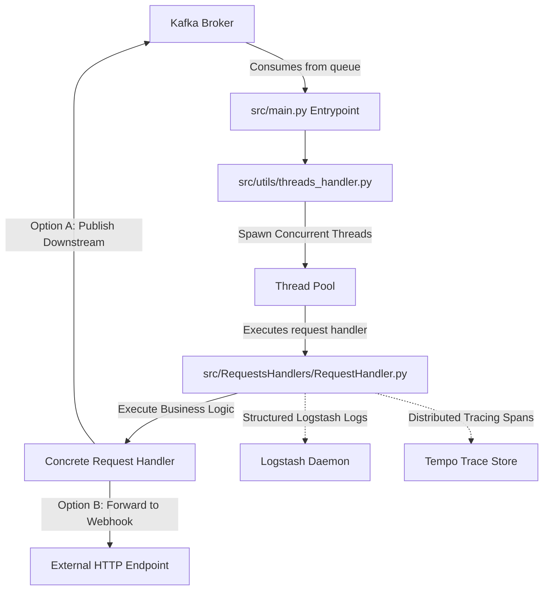

# Rabbit Processor

`RabbitProcessor` is a production-ready, highly concurrent, multi-threaded Kafka-based message processing framework. It is designed to function as a telemetry-instrumented orchestrator and bridge, consuming requests from Kafka topics, performing processing (such as downloading assets, executing database writes, or calling external APIs), logging structured metrics, and routing results downstream.

---

## Table of Contents
1. [Architecture Overview](#architecture-overview)
2. [What This Repository Brings to the Table](#what-this-repository-brings-to-the-table)
3. [How to Create a Pipeline](#how-to-create-a-pipeline)
4. [How to Create a Service in a Pipeline](#how-to-create-a-service-in-a-pipeline)
5. [Observability Features & Integration Guide](#observability-features--integration-guide)
6. [Configuration Variables](#configuration-variables)
7. [Local Development Setup](#local-development-setup)
8. [Docker Deployment](#docker-deployment)

---

## Architecture Overview



### Key Components

*   **[src/main.py](file:///Users/dorokah/Documents/code/python/RabbitProcessor/src/main.py)**: The service entrypoint. Connects to the Kafka broker, declares consumers/producers, configures signal traps (`SIGTERM`), and kicks off the message consumption loop.
*   **[src/utils/threads_handler.py](file:///Users/dorokah/Documents/code/python/RabbitProcessor/src/utils/threads_handler.py)**: Manages concurrent execution by dispatching incoming Kafka messages to OS-level threads. Handles clean shutdown on `SIGTERM`.
*   **[src/RequestsHandlers/RequestHandler.py](file:///Users/dorokah/Documents/code/python/RabbitProcessor/src/RequestsHandlers/RequestHandler.py)**: Abstract base class enforcing the request handling lifecycle: tracing context extraction, performance metrics recording, error handling boundaries, and acknowledgment (ACK) signals.
*   **[src/utils/service_logger.py](file:///Users/dorokah/Documents/code/python/RabbitProcessor/src/utils/service_logger.py)**: Logger class aggregating metadata fields per request and shipping them in JSON format to Logstash and Tempo trace annotations.

---

## What This Repository Brings to the Table

1. **High Concurrency & Multi-Threading**: Out-of-the-box asynchronous OS thread pool handling incoming messages, maximizing I/O performance (e.g. database writes, HTTP calls) without blocking the consumption loop.
2. **Flexible Request Handler Abstraction**: A base `RequestHandler` template managing transaction setup, logging, distributed tracing propagation, error capture, and output queue publication.
3. **Structured Telemetry (ELK integration)**: Structured JSON-based logging to Logstash which directly populates Elasticsearch, avoiding raw text logs and allowing rich dashboard filters.
4. **Distributed Tracing (OpenTracing/Tempo)**: Automatic injection and propagation of OpenTracing-compliant headers across Kafka topics. The entire multi-service flow is linked under a single distributed trace.
5. **Modern Explore UI Support**: Modern Grafana URL integration supporting direct trace-to-logs navigation in a new tab.

---

## How to Create a Pipeline

A **pipeline** in RabbitProcessor is a chain of independent, single-responsibility services connected through Kafka topics. For example, the default Pokemon pipeline consists of:

```
[pokedex_producer] 
       │
       ▼ (Topic: pokedex-raw)
[splitter-service] ──► Splits list into individual records
       │
       ▼ (Topic: pokemon-individual)
[hbase-writer-service] ──► Writes records to HBase database
       │
       ▼ (Topic: hbase-status)
[webhook-service] ──► POSTs success status downstream
       │
       ▼
[httpbin / Webhook Mock]
```

### Steps to Define a Pipeline:
1. Identify the steps of your business logic. Each step should be its own microservice to ensure clean scaling.
2. Define the Kafka topics that will connect your services (e.g. `raw-events` -> `processed-events` -> `notifications`).
3. Provision the pipeline in [docker-compose.yml](file:///Users/dorokah/Documents/code/python/RabbitProcessor/docker-compose.yml) by spawning one service container per step, defining their `CONSUME_TOPIC` and `PUBLISH_TOPIC`.

---

## How to Create a Service in a Pipeline

To add a new processing step (service) to a pipeline:

### Step 1: Create a Concrete Request Handler
Create a new file under `src/RequestsHandlers/` (or in a subfolder). Inherit from `RequestHandler` and implement the abstract methods:

```python
from src.RequestsHandlers.RequestHandler import RequestHandler
from src.utils.service_logger import ServiceLogger

class MyNewServiceHandler(RequestHandler):
    def __init__(self, service_logger: ServiceLogger):
        super().__init__(service_logger)
        # Initialize resources (DB clients, HTTP clients, etc.)

    def request_pre_processing(self, body):
        # 1. Parse incoming message body (usually JSON)
        # 2. Return the request object and optional binary data (e.g. image bytes)
        import json
        request = json.loads(body)
        return request, None

    def perform_actions(self, body, request_start_timestamp):
        # 1. Pre-process incoming data
        request, binary_data = self.request_pre_processing(body)
        
        # 2. Call the core business logic (e.g. perform database writes or calculations)
        result = self.perform_service_call(request, binary_data)
        
        # 3. Log success
        self.service_logger.log_success_logstash(request_start_timestamp)
        return result

    def perform_service_call(self, request, binary_data):
        # Write your core business logic here
        entity_id = request.get("id")
        self.service_logger.info(f"Processing entity: {entity_id}")
        
        # Return results to publish downstream
        return {
            "status": "success",
            "entityId": entity_id,
            "results": {"processedAt": "timestamp"}
        }

    def get_publish_queue(self):
        # Return target Kafka topic name to send the results to, or None to stop pipeline
        return "my-output-topic"
```

### Step 2: Register in Docker Compose
Configure your service in [docker-compose.yml](file:///Users/dorokah/Documents/code/python/RabbitProcessor/docker-compose.yml) by passing the handler classpath and queues:

```yaml
  my-new-service:
    build:
      context: .
      dockerfile: Dockerfile
    container_name: my-new-service
    depends_on:
      - kafka
      - logstash
    environment:
      - REQUEST_HANDLER=src.RequestsHandlers.pipeline.MyNewServiceHandler
      - KAFKA_BOOTSTRAP_SERVERS=kafka:9092
      - CONSUME_TOPIC=my-input-topic
      - PUBLISH_TOPIC=my-output-topic
      - SERVICE_NAME=my-new-service
      - LOGSTASH_ENABLE=True
      - LOGSTASH_HOST=logstash
      - LOGSTASH_PORT=5044
      - TRACING_ENABLE=True
      - JAEGER_AGENT_HOST=tempo
      - JAEGER_AGENT_PORT=6831
```

---

## Observability Features & Integration Guide

This repository includes a full observability suite powered by the **LGTM** (Loki/Elasticsearch, Grafana, Tempo) stack:

### 1. Structured Logging (Elasticsearch + Logstash)
* Every request execution emits structured metadata logs containing `serviceName`, `pipelineName`, `requestId`, `entityId`, `traceId`, `processingDuration`, and `statusType` (`processingSuccess` / `processingError`).
* Logstash maps and index-partitions these logs in Elasticsearch (`rabbitprocessor-YYYY.MM.DD`).

### 2. Distributed Tracing (Tempo + OpenTracing)
* The entrypoint initializes a Jaeger-compatible distributed tracer.
* When a message enters the pipeline, a root span is created. Spans and trace headers are injected into Kafka headers and propagated downstream.
* Tempo collects UDP compact Thrift traces at port `6831`.

### 3. Grafana Dashboard (Logs-to-Trace Navigation)
* Grafana serves the `rabbitprocessor-overview` dashboard at `http://localhost:3000`.
* **Dynamic Row Duplication**: The dashboard is built with a repeating row keyed to the `$service_name` template variable.
  - Selecting **"All"** (default) or multi-selecting specific services in the top dropdown automatically repeats the row + all nested panels for each service.
  - When you add a new service (e.g. `my-new-service` under `docker-compose.yml`), it starts sending telemetry containing `serviceName: "my-new-service"` to Logstash. Grafana's Elasticsearch query picks this up dynamically, automatically adding a new row with working metrics and logs for it!
* **Nested Panel Rows**:
  Each duplicated service row contains:
  - **Processed Items**: Total messages processed.
  - **Success Count**: Total successful runs.
  - **Failure Count**: Total failed runs.
  - **Avg Duration**: Average execution duration in seconds.
  - **Processing Duration Percentiles**: A line chart showing p50, p75, p99, and p100 (max) values over time.
  - **Service Log Stream**: Real-time log logs scoped precisely to that service.
* **Correlated Exploration (Logs to Trace)**: 
  Every log line displayed in the Service Log Stream panel includes an active `traceId` link. Clicking it opens a **new tab** directly in Grafana's Tempo Explore panel, rendering the complete distributed span waterfall tree for that transaction.
* The link is provisioned via the Elasticsearch datasource `dataLinks` configuration:
  ```yaml
  dataLinks:
    - field: "traceId"
      url: 'http://localhost:3000/explore?schemaVersion=1&panes={"tp":{"datasource":"tempo-ds","queries":[{"refId":"A","queryType":"traceql","query":"$${__value.raw}","datasource":{"type":"tempo","uid":"tempo-ds"},"limit":20,"tableType":"traces"}],"range":{"from":"now-6h","to":"now"}}}&orgId=1'
      targetBlank: true
  ```

---

## Configuration Variables

The application is configured using environment variables defined in [src/utils/config_provider.py](file:///Users/dorokah/Documents/code/python/RabbitProcessor/src/utils/config_provider.py):

| Variable | Description | Default |
|----------|-------------|---------|
| `REQUEST_HANDLER` | Classpath of the handler to run | (Required) |
| `KAFKA_BOOTSTRAP_SERVERS` | Kafka host bootstrap list | `localhost:9092` |
| `KAFKA_GROUP_ID` | Kafka consumer group ID | `processor-group` |
| `CONSUME_TOPIC` | Kafka topic to consume messages from | `""` |
| `PUBLISH_TOPIC` | Kafka topic to publish results to | `""` |
| `SERVICE_NAME` | Name identifier for tracing & log categorization | `""` |
| `LOGSTASH_ENABLE` | Enable shipping logs to Logstash daemon | `False` |
| `LOGSTASH_HOST` | Hostname for the Logstash server | `""` |
| `LOGSTASH_PORT` | Port for the Logstash server | `0` |
| `TRACING_ENABLE` | Enable distributed tracing via Tempo | `False` |
| `SERVICE_TIMEOUT` | Timeout in seconds for downstream HTTP posts | `30` |

---

## Local Development Setup

### Prerequisites
* Python 3.14
* `uv` package manager installed globally

### Installation & Run

1. Initialize local virtual environment:
   ```bash
   uv venv --python 3.14
   ```
2. Install project dependencies:
   ```bash
   uv pip install tornado==6.5.7 jaeger-client==4.8.0
   uv pip install --no-deps opentracing-instrumentation==3.3.1
   uv pip install -r deps/requirements.txt
   ```
3. Set environment variables and run locally:
   ```bash
   export REQUEST_HANDLER="src.RequestsHandlers.pipeline.GenericRequestsHandler"
   export CONSUME_TOPIC="my-topic"
   export KAFKA_BOOTSTRAP_SERVERS="localhost:9092"
   
   PYTHONPATH=. .venv/bin/python src/main.py
   ```

---

## Docker Deployment

To build and run the services inside Docker containers:

```bash
# Build and start all pipeline components, databases, and Grafana dashboard:
docker compose up --build -d

# To check running status:
docker compose ps

# View service logs:
docker compose logs -f splitter-service
```

---

## Running a Pipeline Test

To trigger and verify a complete test run of the Pokemon pipeline (Pokedex splitting, database ingestion, and webhook status forward), use the automated pipeline test script:

```bash
# Execute the pipeline test run script
./scripts/run_pipeline_test.sh
```

### What this script does:
1. Verifies that all Docker containers are running properly.
2. Copies the source `pokedex.json` payload from your local host into the `splitter-service` container.
3. Invokes the `pokedex_producer.py` inside the container using `docker compose exec`.
4. The producer publishes the Pokedex structure to the Kafka pipeline, triggering the Splitter, HBase writer, and Webhook status forwarders automatically.

Open **Grafana** at `http://localhost:3000` to watch the processed logs and trace charts update in real-time.
